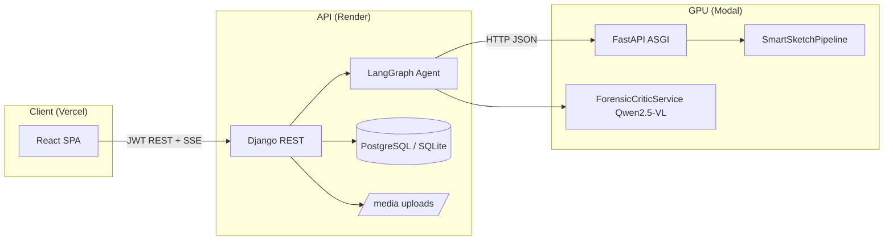

# SmartSketch.AI — Full system architecture (for slide generation)

**Purpose:** Paste or attach this file to Claude (or any slide generator) to produce defense-ready architecture, methodology, and stack slides. Facts below reflect the SmartSketch workspace implementation.

**Team context:** Final-year project — AI-assisted forensic facial composites from natural language, with iterative chat refinement, identity-aware editing, and deployment across a thin web tier + GPU serverless ML.

---

## 1. One-sentence pitch

SmartSketch is a **JWT-authenticated web application** where investigators describe a suspect in **chat**; a **LangGraph** agent on **Django** interprets each turn, routes to **generate / edit / inpaint / age** on a **Modal GPU service** (SDXL family + Qwen + CLIP + optional VLM critic), persists **state and images** in a **SQL** database, and returns **scores, critic feedback, and images** to a **React** SPA.

---

## 2. Logical architecture (tiers)

| Tier | Role | Primary technology | Notes |
|------|------|-------------------|--------|
| **Presentation** | Login, signup, chat UI, forensic console (streaming logs), sketch style controls, session artifacts | **React 19**, **TypeScript**, **Vite**, **Tailwind**, **React Router** | Hosted on **Vercel** (typical). Calls backend via `VITE_API_BASE_URL` → `/api/...`. Uses **Bearer JWT**; chat streaming uses **fetch + SSE** (not EventSource) so auth headers work. |
| **Application / API** | Auth, REST, orchestration, persistence, audit | **Django 5.x**, **Django REST Framework**, **simplejwt** | Hosted on **Render** (typical). **CPU-only** in production: no Torch on the web dyno unless `USE_LOCAL_ML=True` (dev GPU only). |
| **ML inference** | SDXL generation, ControlNet img2img, inpainting, aging, Qwen analyze, Qwen2.5-VL critic, GFPGAN, hashing/watermark | **Modal** (`@app.cls` GPU, **FastAPI** ASGI), **`ml_engine`** Python package copied into Modal image | **L4-class GPU** (configurable `MODAL_GPU`). **HuggingFace cache** on **Modal Volume** (`smartsketch-models`). Django calls Modal using **`COLAB_ML_URL` / `REMOTE_ML_URL`** (historical name; points at Modal base URL). |

**Data flow (happy path):** Browser → HTTPS → Django REST → (optional) Modal HTTP JSON with base64 images ↔ Modal loads `SmartSketchPipeline` / critic class → JSON back → Django saves **`GeneratedImage`** + scores + critique rows → response includes **inline PNG data URL** for chat (avoids broken `/media/` on production) plus DB IDs.

---

## 3. Mermaid — deployment & request flow

---

## 4. LangGraph agent (core “AI orchestration” novelty)

**Class:** `SmartSketchAgent` (`ml_engine/agent.py`). **State schema:** `ForensicAgentState` + **`SuspectProfile`** (Pydantic structured fields: demographics, hair, eyes, distinctive features, etc.) (`ml_engine/agent_state.py`).

**Graph (high level):**

1. **`analyze`** — `AnalyzerNode`: updates profile from user text; infers **intent** (`generate` / `edit` / `inpaint` / `age`); produces **enhanced_prompt**, **negative_prompt**, **age_params** when relevant. Resolution order: configured LLM → **Modal `/analyze`** (Qwen JSON with self-healing parse) → **heuristic fallback** if no LLM.
2. **`route`** — `RouterNode`: sets **`next_step`** to `generate` | `edit` | `inpaint` | `age` using: presence of current image, “wrong person / start over” phrases, aging language + `age_params`, facial-region keywords (eyes, nose, lips, brows, glasses) for **inpaint**, else **ControlNet edit**.
3. **`artist`** — `_artist_node`: calls **local** `SmartSketchPipeline` *or* **remote Modal** (`/generate`, `/edit`, `/age`, inpaint path) depending on settings; increments **`ml_attempt_count`**.
4. **`verify`** — `VerificationNode`: **CLIP (+ optional FaceNet identity)** combined score; optional **forensic VLM critic** (Modal); **`retry`** → back to `artist` with critic **prompt_adjustment** or low-score retry (bounded **`MAX_RETRIES`** / **`SMARTSKETCH_CRITIC_MAX_RETRIES`**).

**Persistence:** **`DjangoCheckpointer`** stores LangGraph checkpoints in **`AgentCheckpoint`** (thread_id, serialized state) so conversations survive restarts.

**Static diagram export:** `backend-service/scripts/export_langgraph_graph.py` → `ml_engine/smartsketch_agent_graph.mmd` (Mermaid; note LangGraph may collapse parallel edges to the same node in the drawing).

---

## 5. SmartSketchPipeline (ML stages inside Modal / local GPU)

**Entry:** `SmartSketchPipeline.from_pretrained` (`ml_engine/pipeline.py`).

**Typical generation path (`generate_sketch`):**

1. **Validate / enhance** — `ForensicPromptValidator` (**Qwen2.5-3B-Instruct**): forensic wording, safety, age rules; optional **forensic override** for structural edit phrases wrongly rejected.
2. **Generate** — `FaceGenerator`: **SDXL** + optional **LoRA**; **`num_images_per_prompt=1`**; strong **negative prompts** against collage / multi-face; positive framing for single frontal forensic portrait; optional **IP-Adapter** path.
3. **Optional sketch modality** — `MemoryEfficientSketchConverter` / ControlNet Canny-style path per config.
4. **Optional restoration** — `FaceRestorer` (**GFPGAN**).
5. **Integrity** — `ForensicSigner`: **SHA-256** content hash + **invisible watermark** (DWT-DCT); optional **`ForensicSafetyChecker`** (diffusers safety) when enabled.
6. **Score** — `FaceScorer` (**CLIP ViT-B/32**); combined score uses **60% CLIP + 40% identity** when identity scalar is present.

**Edit path (`edit_sketch`):** `FaceEditor` — **SDXL ControlNet Img2Img** + **Canny** structure lock; **FaceNet**-style embeddings for **identity_score**; tunable strictness via env (e.g. `SMARTSKETCH_IDENTITY_PRESERVED_THRESHOLD`, `SMARTSKETCH_CONTROLNET_CONDITIONING_SCALE`, `SMARTSKETCH_EDIT_IP_ADAPTER_SCALE`).

**Inpaint path (`inpainting_edit`):** `FaceInpainter` — **SDXL inpainting** checkpoint; **MediaPipe**-derived masks by facial region; identity scoring aligned with editor philosophy.

**Age path:** Dedicated aging flow (analyzer/router + pipeline / Modal **`/age`**).

---

## 6. Modal service surface (GPU worker)

**App:** `ml_service/modal_app.py` — image build installs PyTorch, diffusers, transformers, xformers, controlnet-aux, CLIP (git), GFPGAN, facenet-pytorch, mediapipe, invisible-watermark, etc.; mounts **`ml_engine`** into `/root/ml_engine`.

**Main classes:**

- **`SmartSketchService`** — `@modal.enter` loads **`SmartSketchPipeline.from_pretrained`** once per container; methods **`generate`**, **`edit`**, **`age`**, **`analyze`** (exposed through FastAPI routes **`/generate`**, **`/edit`**, **`/age`**, **`/analyze`**).
- **`ForensicCriticService`** — separate Modal class; default **Qwen2.5-VL-3B-Instruct**; **`/critic`** returns structured JSON: decision, issues, matched/missing features, prompt adjustment, safety flags.

**HTTP:** ASGI app mounted via **`@modal.asgi_app()`**; Django strips suffixes from base URL and POSTs JSON bodies with **base64 images** where required.

---

## 7. Django REST API (representative routes)

All under **`/api/`** (see `api/urls.py`):

- **Auth:** `POST /api/token/`, `POST /api/token/refresh/`, `POST /api/register/`
- **User:** `GET/PUT /api/profile/`, `GET /api/my-images/`
- **Forensics:** `POST /api/forensic/generate/`, `POST /api/forensic/edit/`, `POST /api/forensic/age/`, `POST /api/forensic/sketch-style/`, `POST /api/forensic/export-report/`
- **Agent (chat):** `POST /api/forensic/chat/`, `POST /api/forensic/chat/stream/` (SSE: `status`, `progress`, `result`, `error`)
- **Governance:** `GET /api/audit-logs/`, forensic request create/approve endpoints
- **Ops:** `GET /api/health/`

**CORS:** Explicit allowlist for Vercel + local dev (`settings.py`).

**Media:** `MEDIA_URL=/media/`; **`urls.py` serves `MEDIA_ROOT` in all environments** so production thumbnails/history URLs work; **Render** uses **`SECURE_PROXY_SSL_HEADER`** when `RENDER` env is set so **`build_absolute_uri`** uses **https**.

---

## 8. Data model (conceptual entities)

Useful for ER / “database design” slides:

- **`User`** — custom user (roles: admin, editor, forensic in product copy)
- **`GeneratedImage`** — stored file, `generation_id`, forensic hash / watermark flags
- **`EditedImage`** — lineage from original generation
- **`ImageScore`** — CLIP / identity / combined scores linked to images
- **`ForensicCritique`** — critic JSON, decisions, safety flags
- **`AgentCheckpoint`** — LangGraph serialized checkpoints keyed by **`thread_id`**
- **`Conversation`** — thread metadata + case number
- **`AuditLog`**, **`ForensicRequest`** — accountability / approval workflow

---

## 9. Frontend structure (for “implementation” slides)

- **Pages:** Login, signup, home workspace (chat + **RightPanel**: sketch mode, aging slider, pipeline step indicators, forensic console logs).
- **State:** Session artifacts list, `thread_id` client-side ref for agent continuity.
- **Types:** `GenerateResult`, `AgentChatResult`, streaming event types (`types.ts`).
- **API layer:** `lib/api.ts` — `request()` with JWT refresh-on-401; **`agentChatStream`** parses SSE manually.

---

## 10. Security, ethics, and forensic posture

- **JWT** access + refresh; authenticated forensic endpoints.
- **Prompt validation** (Qwen) + optional **image safety** checker; **age / case-type** rules in validator design.
- **Integrity:** content hash + invisible watermark on pipeline outputs (chain-of-custody narrative for slides).
- **Audit logs** and optional **forensic request approval** workflow (governance slide).
- **Honest limitations:** not certified legal evidence without institutional validation; model and demographic bias risks; witness language quality dependence.

---

## 11. Novel contributions (bullet list for “contribution / novelty” slides)

1. **LangGraph-based conversational forensic workflow** with explicit **analyze → route → artist → verify** and **bounded retry** driven by scores + **VLM critic**.
2. **Structured suspect profile** accumulated across turns; **profile-to-prompt** fusion; **negative prompt sanitization** vs profile text.
3. **Semantic routing** among **full generate**, **global ControlNet edit**, **region inpaint**, and **age** — not a single monolithic text-to-image call.
4. **Self-hosted multimodal critic** (Qwen2.5-VL) returning actionable **prompt_adjustment** JSON.
5. **Hybrid deployment:** thin **Django** API + **Modal** GPU autoscale + **persistent HF cache volume**; optional **local GPU** path for research (`USE_LOCAL_ML`).
6. **Closed-loop quality:** CLIP (+ identity when available) **combined metric** + critic loop + verification history in agent state.
7. **Production-oriented UX fix:** agent chat returns **inline PNG data URLs** so HTTPS SPAs render composites even when media URL routing or mixed content would otherwise break images.

---

## 12. Suggested slide deck outline (for Claude)

1. Title + team  
2. Problem statement (manual sketches, time, consistency)  
3. Objectives & scope  
4. **High-level architecture** (Mermaid above)  
5. **Deployment diagram** (Vercel / Render / Modal + env vars)  
6. **User journey** (signup → chat → refine → export)  
7. **LangGraph state machine** (nodes + conditional edges + retry)  
8. **`SuspectProfile` & state** (structured memory slide)  
9. **Pipeline stages** (validate → generate → optional sketch/GFPGAN → sign/hash → score)  
10. **Edit vs inpaint vs age** (routing table from `RouterNode` + Modal `/edit` keyword split)  
11. **Modal internals** (Docker-ish image, GPU class, volume, endpoints table)  
12. **Critic service** (inputs/outputs JSON schema)  
13. **REST API table** (subset of routes)  
14. **Database ER** (entities in §8)  
15. **Security & ethics**  
16. **Testing strategy** (unit, integration, Postman, k6 mention if used)  
17. **Results / screenshots**  
18. **Limitations & future work**  
19. **SDG / societal impact** (if required)  
20. Q&A backup — **observability:** optional LangSmith; logs in agent nodes.

---

## 13. Glossary (for speaker notes)

| Term | Meaning |
|------|--------|
| **SDXL** | Stable Diffusion XL base image model |
| **ControlNet** | Conditioning network (e.g. Canny edges) for img2img structural lock |
| **CLIP** | Text–image alignment model for scoring |
| **LangGraph** | Library for cyclic stateful agent graphs with checkpointing |
| **Modal** | Serverless GPU platform used as ML worker |
| **JWT** | JSON Web Token auth for API |

---

*End of architecture brief — safe to truncate §12–13 for shorter decks; expand §5–6 with parameter tables if the audience is technical.*
